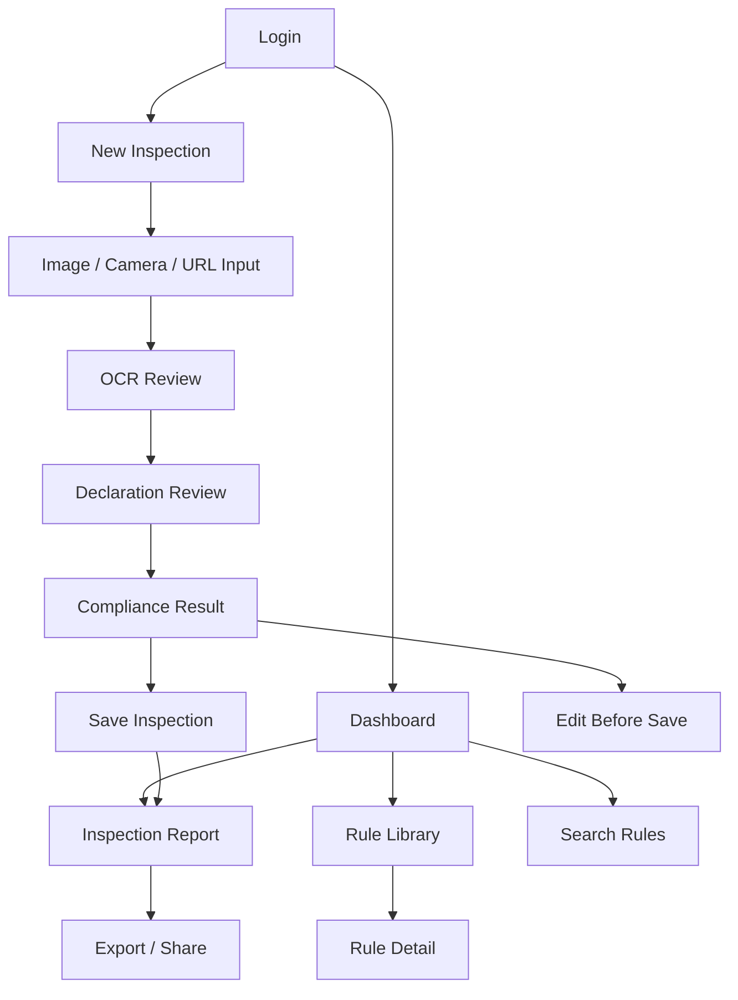

# MOBILE UX SPECIFICATION

This document defines the Android user experience for PARAKH based on the verified web application and the actual server/client behavior in the repository. It translates the existing browser functionality into a native Android experience without copying the website layout or desktop interaction patterns.

## 1. Design principles

The Android app must preserve the current system behavior while reimagining the experience for mobile users.

### Core goals
- Keep the workflow fast and one-handed
- Use bottom navigation for the main destinations
- Prioritize large tap targets and simple forms
- Replace wide desktop views with cards, lists, and stacked details
- Use native Android patterns such as bottom sheets, dialogs, snackbar feedback, and full-screen flows
- Avoid unnecessary typing by using OCR, auto-fill, search, and quick actions
- Keep the inspection flow guided, linear, and forgiving

### Product behavior to preserve
- upload label images and run OCR
- optionally fetch product details from a URL
- confirm or correct declaration data
- run legal-metrology compliance checks against the rule engine
- view result summaries and violations
- review historical inspections
- browse rules and legal references
- export/share report details

### What must not be copied from the website
- desktop grid layouts
- wide tables
- multi-column forms
- browser-style top navigation
- large full-page content blocks
- separate page-per-step patterns that do not feel native on Android

---

## 2. Mobile app structure

The Android app should be structured as a modern mobile product with these primary destinations:

1. Login / Authentication
2. Overview / Dashboard
3. New Inspection
4. Rule Library
5. Report Details

### Primary navigation model
- Bottom navigation for the core destinations:
  - Overview
  - Scan
  - Rules
- A dedicated overflow menu or profile section for:
  - logout
  - account status
  - developer/debug info only if needed in internal builds

### Mobile-first interaction model
- Default actions are large and visible at the bottom of the screen
- Data-heavy information is grouped into cards or expandable sections
- Long-form entry is minimized with OCR and intake helpers
- Validation happens inline where possible and in summary dialog after final submit

---

## 3. Complete mobile navigation map

### High-level app flow

### Screen map

- Auth
  - Login
  - Register (if enabled by backend)
  - Session restore

- Dashboard
  - Overview summary
  - Recent inspections list
  - Filter chips for status/severity
  - Open report
  - Start new inspection

- New Inspection
  - Intake mode selector: camera, gallery, manual entry, product URL
  - OCR review screen
  - Declaration form
  - Result summary
  - Save or edit again

- Rules
  - Search rules
  - Filter by category and severity
  - Rule details

- Reports
  - Inspection header card
  - Violation list
  - Declared fields summary
  - Export / share actions

---

## 4. Screen specifications

## 4.1 Login Screen

### Screen name
Login

### Purpose
Authenticate the user before using the app. This is the mobile equivalent of the website’s entry/auth gate.

### Entry points
- App launch
- Expired session
- Logged-out state
- Optional registration CTA

### Data displayed
- Email field
- Password field
- App logo or product title
- Optional remember-me toggles

### User actions
- Enter email and password
- Tap Login
- Tap Register if the flow is enabled
- Use password visibility toggle
- Recover/reset account only if supported by backend

### Forms
- Email
- Password

### Validation
- Email format required
- Password not empty
- Show inline validation on invalid input
- Show generic authentication failure below form if login fails

### Navigation
- On success: move to Dashboard
- On failure: remain on Login and show error
- Register route leads to account creation screen

### API calls
- POST /api/auth/login
- GET /api/me after login if session details are loaded

### Loading state
- Disable login button
- Show progress indicator
- Replace button text with “Signing in…”

### Empty state
- Not applicable

### Error state
- Invalid credentials
- Network failure
- Server unavailable
- Session expired

### Success state
- Token saved securely
- Redirect to Dashboard
- Optional biometric/remembered session state if supported later

---

## 4.2 Dashboard / Overview Screen

### Screen name
Overview

### Purpose
Give users immediate visibility into their recent compliance activity and the health of current inspection work.

### Entry points
- App launch after login
- Bottom navigation Overview tab
- Back from report or rule details

### Data displayed
- Total inspections count
- Total violations count
- Compliance percentage
- Critical violations count
- Recent inspections list
- Violation trend cards by brand/category/severity
- “Ready to inspect” CTA

### User actions
- Tap New Inspection
- Open a recent inspection
- Swipe to refresh
- Filter summary by time or severity if added later
- Clear data only if the app is explicitly allowed to do so

### Forms
- Optional filter chips for severity or brand
- Search in recent inspections if list grows large

### Validation
- No required form action on entry
- Empty dataset handled gracefully

### Navigation
- Bottom nav: Overview / Scan / Rules
- Tap an inspection item to open report details
- Tap FAB or primary button for new inspection

### API calls
- GET /api/inspections
- GET /api/inspections/:id when opening a report

### Loading state
- Skeleton cards for totals and recent list
- Progress indicator while fetching inspections

### Empty state
- “No inspections yet” with a primary CTA to start a new inspection
- Show empty summary cards with neutral messaging

### Error state
- Failed to load inspections
- Retry action
- Offline/empty state fallback

### Success state
- Dashboard renders with counts and recent items
- Last successful sync timestamp if available

---

## 4.3 New Inspection / Scan Screen

### Screen name
New Inspection

### Purpose
Capture a product label, gather raw declaration data, validate it, and generate a compliance result. This is the mobile equivalent of the website’s Scan Product page.

### Entry points
- Bottom nav Scan tab
- Floating action button on Dashboard
- CTA after a failed or incomplete inspection

### Data displayed
- Product name and brand fields
- Product category selector
- Label image preview cards
- OCR text area
- Product URL field
- Declaration fields form
- Compliance result summary after evaluation

### User actions
- Capture or upload image(s)
- Choose from camera or gallery
- Add product URL
- Run OCR
- Fetch product page content
- Auto-fill fields from OCR or URL extraction
- Edit declaration values
- Run compliance validation
- Save inspection
- Retry extraction

### Forms
- Image upload area
- Product URL input
- Product category dropdown or selector
- Declaration fields form with grouped sections
- Raw text editing area

### Validation
- Only valid image files accepted
- URL format validation if provided
- Required declaration fields must be present before saving
- Missing mandatory fields flagged inline
- Empty OCR/raw text shows warning before extraction
- Validation feedback shown before the final report is saved

### Navigation
- Multi-step full-screen flow:
  1. Intake
  2. OCR review
  3. Declaration review
  4. Result summary
- Back button allowed between steps
- Final action navigates to report detail

### API calls
- GET /api/fetch-product-page?url=...
- POST /api/extract-product
- POST /api/inspections for save
- Optional later PUT /api/inspections/:id when editing an existing draft

### Loading state
- OCR progress indicator with status text
- Auto-fill extraction in progress
- Product URL fetch progress banner
- Final evaluation progress spinner

### Empty state
- No images selected
- No text available yet
- No product URL entered
- No fetched product details available

### Error state
- Missing API key or extraction failure
- URL fetch failure
- OCR unavailable
- Invalid/blocked page
- Failed save
- Missing mandatory declaration data

### Success state
- OCR text populated
- Product fields auto-filled
- Compliance result generated
- Save action completes and opens report detail

---

## 4.4 Rule Library Screen

### Screen name
Rules

### Purpose
Provide searchable access to the legal-metrology rule database. This is the mobile equivalent of the website’s Rule Library page.

### Entry points
- Bottom navigation Rules tab
- Quick action from result summary to inspect a rule
- Search from dashboard or report details if included later

### Data displayed
- Search field
- Filter chips for category and severity
- Rule cards with ID, field, and condition summary
- Rule detail screen with legal reference and examples

### User actions
- Search by rule ID, field, text, or reference
- Filter by category
- Filter by severity
- Open a rule for detail
- Clear filters

### Forms
- Search input
- Filter chips / bottom sheet selectors

### Validation
- No blocking validation; search results update live
- Empty query shows all rules or a neutral empty message depending on design choice

### Navigation
- Rules screen is a searchable list
- Rule card tap opens full detail sheet or full-screen detail view
- Back navigation returns to list

### API calls
- No backend call if rules are bundled locally in the app
- If fetched from a server later, use a rules endpoint or packaged JSON

### Loading state
- Skeleton cards while loading rule catalog
- Progressive search results update

### Empty state
- No rules match current filters
- “Try clearing filters” CTA

### Error state
- Rules data unavailable
- Retry option
- Offline fallback message

### Success state
- Rule list appears with filters and matching count
- Opened rule shows legal references and valid/invalid examples

---

## 4.5 Inspection Report Screen

### Screen name
Inspection Report

### Purpose
Show a completed inspection in a compact, readable format with recorded declarations, violations, and summary details. This replaces the web report page.

### Entry points
- Tap recent inspection from Dashboard
- Tap saved report after New Inspection
- Click through from summary screen

### Data displayed
- Inspection ID and date
- Product summary card
- Declared values
- Violation list with severity, rule reference, and recommendation
- Compliance score or summary badge
- Export/share actions

### User actions
- View summary
- Expand/collapse sections
- Tap a violation for more detail
- Export CSV or share report
- Print or save as PDF if supported by Android share/export flow
- Edit inspection or reopen form

### Forms
- No primary form except optional notes or comments if later added
- Filters or details expandable accordion panels

### Validation
- If report data missing, show a not-found or expired state
- If required details absent, show the report as incomplete

### Navigation
- Screen is a full-detail view with sections
- Bottom action bar contains primary actions like share/export and edit
- Back returns to dashboard or recent list

### API calls
- GET /api/inspections/:id
- Optional export or share logic in-app, not a server endpoint in the current website

### Loading state
- Shimmer for report sections
- Progress bar while fetching report data

### Empty state
- Report not found or no stored inspection
- “Start a new inspection” CTA

### Error state
- Failed to fetch report
- Invalid inspection ID
- Offline issue while loading history

### Success state
- Report loads with all values and violations
- User can export or share results

---

## 5. Supporting mobile patterns and components

## 5.1 Bottom navigation
Use bottom navigation for:
- Overview
- Scan
- Rules

This matches the app’s main destinations and keeps key flows reachable with one thumb.

## 5.2 Floating action button
Use a primary floating action button on the dashboard and other list screens for:
- New inspection
- Add image
- Save result

## 5.3 Bottom sheets
Use bottom sheets for:
- image source selection: camera, gallery, URL import
- rule filters
- quick actions on inspection cards
- report export choices

## 5.4 Dialogs
Use dialogs for:
- discard unsaved changes
- missing required fields before final save
- upload source selection confirmation
- error messages that require acknowledgment

## 5.5 Cards and lists
Replace wide data tables with:
- inspection summary cards
- violation cards with severity badges
- rule result cards
- report sections as stacked containers

## 5.6 Form design
Use mobile-friendly layouts:
- grouped sections for declaration details
- single-column form layout
- sticky primary action at bottom
- inline validation below each field
- collapsed secondary fields when not needed

## 5.7 Save and feedback
When actions succeed or fail:
- show snackbar for non-blocking success
- show dialog or inline banner for blocking errors
- use clear primary action text: Save, Retry, Continue, Review

---

## 6. Screen flow details by user journey

## 6.1 Login journey
- Launch app
- Enter credentials
- Login button
- Dashboard loads
- Session persists securely

## 6.2 New inspection journey
- Tap Scan from bottom nav or FAB
- Choose image source
- Add product URL optionally
- Run OCR
- Review extracted text
- Correct declaration form
- Run validation
- Review result summary
- Save and open report

## 6.3 Report review journey
- Tap recent inspection
- View summary cards and violation list
- Expand rule details as needed
- Export/share result
- Return to dashboard

## 6.4 Rules lookup journey
- Open Rules tab
- Search/filter quickly
- Select rule
- Review reference, valid vs invalid values, notes
- Return to previous screen

---

## 7. UX decisions based on the verified app

The Android app should preserve the real app behavior while shifting to a mobile-first interpretation of the same product:

- Dashboard remains summary-first and fast to scan
- Scan remains the central workflow
- Rules remain searchable reference material
- Report remains detail-oriented and export-ready
- Authentication remains required before use

This is a direct translation of the verified website flow into a native Android experience, not a redesign that invents unrelated product features.

---

## 8. Final UX verdict

The correct Android UX is not a mobile clone of the website. It is a purpose-built app that keeps the same legal-metrology inspection workflow but packages it into native mobile flows:

- bottom navigation for the main app destinations
- scan-first task flow with guided steps
- cards and list-based inspection review
- native dialogs and bottom sheets for actions and filters
- large tap targets and reduced typing via OCR and autofill
- one-handed actions prioritized over desktop form density

This UX is grounded in the actual app functionality already present in the current repository and is ready to be translated into Android screens and navigation without writing native code yet.
